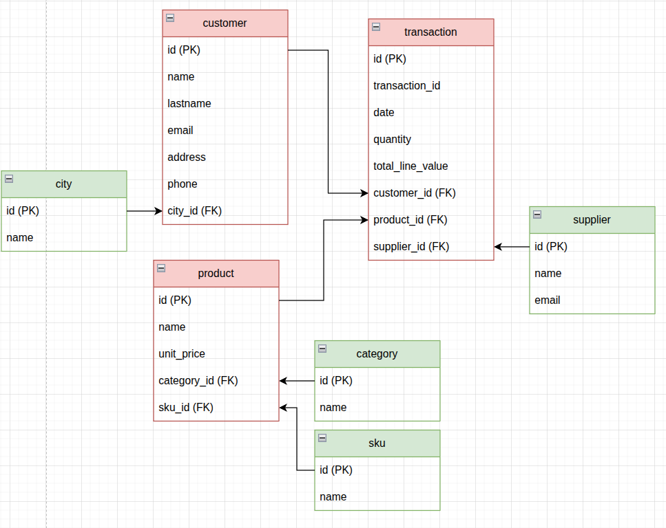
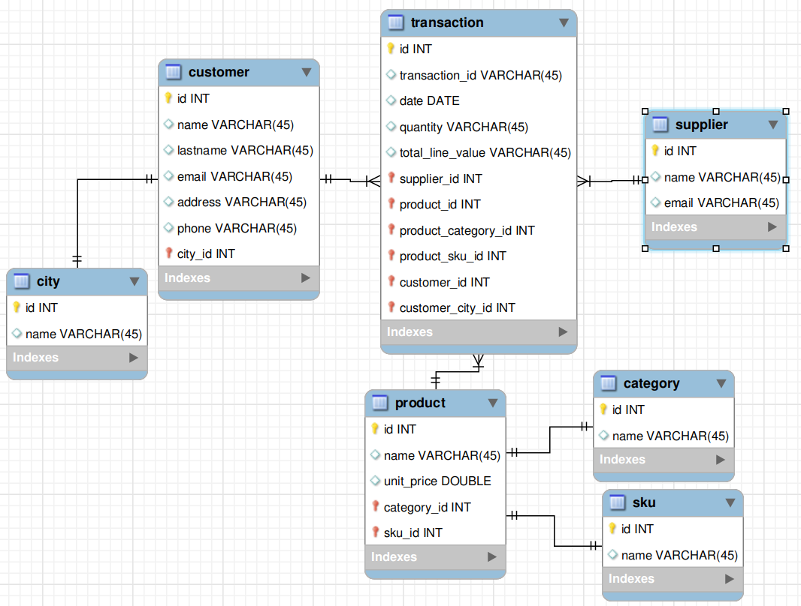
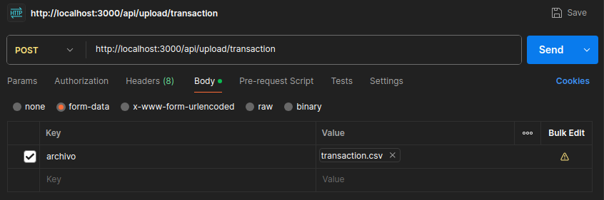

# PROJECT


## INTRODUCTION
You have joined the engineering team of **`LogiTech Solutions`**, a specialist consultancy in modernization of systems for retail and e-commerce.

One of its largest clients, the supply giant "**`MegaStore Global`**", faces
an operational crisis. For years, they have managed all their inventory, sales, suppliersand clients in a single Excel master file.

The volume of data has grown so much that the file is unmanageable: there are inconsistencies in prices, duplicate customer addresses with misspellings and it’s impossible know the actual stock in real time.

**Your mission:** Act as a Data Architect and Backend Developer to migrate this "**`legacy system`**" to a modern, scalable and persistent architecture, exposing the information via a REST API.

## Objectives
The purpose of this test is to assess your ability to:

1. **Analyze and structure:** Take a flat, disorganized data set, and propose
an optimized data model.
2. **Model architecture:** Design a database schema that eliminates
unnecessary redundancies and ensure the integrity of information.
3. **Persistence:** Implement the database (`SQL and NoSQL`) and populate it
massively according to the case.
4. **Backend development:** Build an API with `Express.js` for data management.
5. **Business intelligence:** Solving complex information requirements
through queries or aggregations.
6. **Audit log:** Handle transaction log in specific scenarios from
`Mongo DB`.

This project is a REST API built with Node.js and Express that enables bulk data upload via CSV files into a ``PostgreSQL`` database, while also logging system operations into ``MongoDB`` for monitoring and auditing purposes.

---

**The system manages structured business data related to:**

- categories
- cities
- customers
- products
- sku
- suppliers
- transactions 

It is designed to automate structured data insertion, making it ideal for data migration, initial database seeding, or enterprise data synchronization processes.

## Architecture

The project follows a hybrid database architecture:

### ``PostgreSQL`` (Relational Database)

Used for structured and relational business data:

- Foreign key relationships
- Referential integrity
- Normalized schema
- Automatic table creation (if not exists)

### ``MongoDB`` (NoSQL Database)

Used for:
- Logging system operations (`CREATE`, `INSERT`, `UPDATE`, `DELETE`)
- Activity tracking
- Audit history

## Data Model
The core entity is the transaction table, which connects:

- category
- city
- customer
- product
- sku
- suppliers
- transaction

This structure ensures complete traceability of every commercial operation performed in the system.

## PROJECT STRUCTURE
```
    ISMAEL-VASCO
    |
    |_express
        |
        |_server.js
        |_.env-example
    |
    |_csv
        |
        |_client.csv
        |_company.csv
        |_contract.csv
        |_employee.csv
        |_invoice.csv
        |_service_category.csv
        |_service.csv
        |_transaction.csv
        
    |
    |_.gitignore
    |_ER-D-mysql.png
    |_ER-D.png
    |_README.md
```
---

### DOCKER COMMAND
Exeecute the following docker command, to deploy the comtainer of `postgreSQL` and `MongoDB`.

**POSTGRESQL**
```
docker run --name postgres -p5434:5432 -e POSTGRES_PASSWORD=password -d postgres
```
**MONGODB**
```
docker run --name mongo -p27017:27017 -d mongo
```
---

## ENTITY RELATIONSHIP DIAGRAM (ERD)
### Relationships
**Model in `Draw.io`:**


**Model in `MySQL`:**


### Model in PostgreSQL (Script SQL):
```sql
    CREATE TABLE IF NOT EXISTS city (
      id SERIAL PRIMARY KEY,
      name VARCHAR(100)
    );

    CREATE TABLE IF NOT EXISTS category (
      id SERIAL PRIMARY KEY,
      name VARCHAR(100)
    );

    CREATE TABLE IF NOT EXISTS sku (
      id SERIAL PRIMARY KEY,
      name VARCHAR(100)
    );

    CREATE TABLE IF NOT EXISTS suppliers (
      id SERIAL PRIMARY KEY,
      name VARCHAR(55),
      email VARCHAR(55)
    );

    CREATE TABLE IF NOT EXISTS customer (
      id SERIAL PRIMARY KEY,
      name VARCHAR(100),
      lastname VARCHAR(100),
      email VARCHAR(100),
      address VARCHAR(100),
      phone VARCHAR(100),
      city_id INT REFERENCES city(id)
    );

    CREATE TABLE IF NOT EXISTS product (
      id SERIAL PRIMARY KEY,
      category_id INT REFERENCES category(id),
      sku_id INT REFERENCES sku(id),
      name VARCHAR(100),
      unit_price DOUBLE PRECISION
    );

    CREATE TABLE IF NOT EXISTS transaction (
      id SERIAL PRIMARY KEY,
      transaction_id VARCHAR(100),
      date DATE,
      customer_id INT REFERENCES customer(id), 
      product_id INT REFERENCES product(id), 
      quantity INTEGER, 
      total_line_value INTEGER, 
      supplier_id INT REFERENCES suppliers(id)
    );
```

---

## LOAD FILES `.CSV` FROM A ENDPOINT IN EXPRESS
This is a simple REST API built with Node.js, Express, and PostgreSQL that allows uploading a CSV file and inserting its data into a database table.

#### Features

- Upload CSV files via HTTP POST request
- Parse CSV content automatically
- Insert data into a PostgreSQL table
- Automatically creates the table if it does not exist

#### Technologies Used

- Node.js
- Express
- Multer
- csv-parse
- PostgreSQL (pg)
- fs (File System)
- dotenv (Environment Variables)
- MongoDB 

#### Installation

**Clone the repository:**
```js
git clone <your-repository-url>
cd <your-project-folder>
```

##### Install dependencies: INTO `express/`
```js
npm install express multer csv-parse pg dotenv mongodb
```
- *Make sure PostgreSQL is running.*
*And create a file called `.env` with your environment variables, like this:*
```js
  USER_PSQL=postgres
  HOST=localhost
  DATABASE=postgres
  PASSWORD=password
  PORT=5434
```

#### Configuration

The application connects to PostgreSQL using the following configuration:
```js
const pool = new Pool({
  user: process.env.USER_PSQL,
  host: process.env.HOST,
  database: process.env.DATABASE,
  password: process.env.PASSWORD,
  port: process.env.PORT,
});
```
- *Update these values according to your local PostgreSQL setup.*

**Mongo Conection**
```js
let logsCollection;
async function connectDB() {
    try {
        // CONECTION
        await client.connect();
        console.log('MONGO CONECTED');

        // CREATE DB
        const db = client.db('app');
        console.log('DB CREATED');

        // CREATE COLLECTION
        logsCollection = db.collection('logs');
        console.log('COLLECTION CREATED');

    } catch (error) {
        console.log(error);
    }
};
connectDB();
```

##### Manage Logs with MongoDB
```js
async function saveLog(action) {
    try {
        await logsCollection.insertOne({
            action,
            created_at: new Date()
        });
        console.log(`LOG ${action} ADDED`)
        
    } catch (error) {
        console.log('error en saveLog');
        
    }
}
```

##### Output Logs in MongoDB
```JS
_id: ObjectId(69a4cf00a9a8d080f4b5993c)
action:"CREATE TABLE OR RECORD" || "INSERT" || "DELETE" || "UPDATE" || "READ ONE OR ALL"
created_at: 2026-03-01T23:42:56.777+00:00
```
In console:
```
MONGO CONECTED
DB CREATED
COLLECTION CREATED
LOG CREATE TABLE ADDED
LOG CREATE TABLE ADDED
LOG CREATE TABLE ADDED
LOG CREATE TABLE ADDED
LOG CREATE TABLE ADDED
LOG CREATE TABLE ADDED
LOG CREATE TABLE ADDED
LOG INSERT ADDED
LOG CREATE RECORD ADDED
LOG READ ONE ADDED
LOG READ ALL ADDED
LOG UPDATED ADDED
LOG DELETE ADDED
```

#### Database

The application automatically creates the following table if it does not exist:
```js
CREATE TABLE IF NOT EXISTS customer (
      id SERIAL PRIMARY KEY,
      name VARCHAR(100),
      lastname VARCHAR(100),
      email VARCHAR(100),
      address VARCHAR(100),
      phone VARCHAR(100),
      city_id INT REFERENCES city(id)
    );
```

#### API Endpoint

*Upload CSV File*

- `POST api/upload/...`
- `Content-Type: multipart/form-data`
- `Form field name: archivo`

**Example using curl:**
```c
curl -X POST http://localhost:3000/upload \
  -F "archivo=@data.csv"
Example CSV Format
```
**Example Postman**


**The CSV file must include headers:**
```csv
id,name,email
1,TechDistro SAS,ventas@techdistro.com
2,Accesorios Total,contacto@accesoriostotal.com
3,MueblesYa,info@mueblesya.com
4,GamerZone,sales@gamerzone.co
5,IluminaTodo,ventas@iluminatodo.co
6,SoundWave Ltd,contact@soundwave.com
7,Cables & Conectores,info@cablesconectores.com
8,Oficina Digital,sales@oficinadigital.com
9,Papeleria Mundial,pedidos@papeleriamundial.com
10,ElectroHogar,ventas@electrohogar.com
```

**Run the Application**
```js
node index.js
```
**Server will start at:**
```c
SERVER http://localhost:3000
```

##### Response

**Successful response**:
```json
{
  "ok": true,
  "total": 5
}
```
**Error response:**
```js
{
  "error": "Error inserting data"
}
```

### ENDPOINTS TO UPLOAD CSV INTO POSTGRESQL
For all of the followings endpoint you need to charge a *`form-data`* into de *`body`* postman o insomnia

*Structure: into `form-data`*

| Name    | Type        | Select File   |
|---------|-------------|---------------|
| archivo | (File) | `select file` |

---
**CITIES** `http://localhost:3000/api/upload/city`
```JS
app.post('/api/upload/city',
  upload.single('archivo'),
  uploadCSV('city', ['name'])
);
```
**CATEGORIES** `http://localhost:3000/api/upload/category`
```JS
app.post('/api/upload/category',
  upload.single('archivo'),
  uploadCSV('category', ['name'])
);
```
**SKU PRODUCT ID** `http://localhost:3000/api/upload/sku`
```JS
app.post('/api/upload/sku',
  upload.single('archivo'),
  uploadCSV('sku', ['name'])
);
```
**SUPPLIERS** `http://localhost:3000/api/upload/suppliers`
```JS
app.post('/api/upload/suppliers',
  upload.single('archivo'),
  uploadCSV('suppliers', ['name','email'])
);
```
**CUSTOMERS** `http://localhost:3000/api/upload/customer`
```JS
app.post('/api/upload/customer',
  upload.single('archivo'),
  uploadCSV('customer', [
    'name',
    'lastname',
    'email',
    'address',
    'phone',
    'city_id'
  ])
);
```
**PRODUCT** `http://localhost:3000/api/upload/product`
```JS
app.post('/api/upload/product',
  upload.single('archivo'),
  uploadCSV('product', [
    'category_id',
    'sku_id',
    'name',
    'unit_price',
  ])
);
```
**TRANSACTIONS** `http://localhost:3000/api/upload/transaction`
```JS
app.post('/api/upload/transaction',
  upload.single('archivo'),
  uploadCSV('transaction', [
    'transaction_id',
    'date',
    'customer_id',
    'product_id',
    'quantity',
    'total_line_value',
    'supplier_id'
  ])
);
```
--- 

### MONGO ENDPOINT
**LOGS TRACKING** `http://localhost:3000/api/logs`
```JS
app.get('/api/logs', async (req,res) =>{
    try {
        const logs = await logsCollection
            .find()
            .sort({ created_at : -1})
            .toArray();
        
        res.json(logs)
    } catch (error) {
        res.status(500).json({ error: 'Internal server error mongoDB' });
    }
});
```

### CRUD ENDPOINTS
**CREATE** `http://localhost:3000/api/transaction`
```js
app.post('/api/transaction', async (req, res) => {
  try {
    const {
      transaction_id,
      date,
      customer_id,
      product_id,
      quantity,
      supplier_id
    } = req.body;

    
    const response = await specific_data(product_id)
    // console.log(response.unit_price)

    const result = await pool.query(
      `INSERT INTO transaction 
      (transaction_id, date, customer_id, product_id, quantity, total_line_value, supplier_id)
      VALUES ($1,$2,$3,$4,$5,$6,$7)
      RETURNING *`,
      [transaction_id, date, customer_id, product_id, quantity,response.unit_price * quantity, supplier_id]
    );

    await saveLog('CREATE RECORD');

    res.status(201).json(result.rows[0]);

  } catch (error) {
    console.error(error);
    res.status(500).json({ error: 'Error creating transaction' });
  }
});
```
**READ ONE** `http://localhost:3000/api/transaction/:id`
```js
app.get('/api/transaction/:id', async (req, res) => {
  try {
    const { id } = req.params;

    const result = await pool.query(
      `SELECT t.id, t.transaction_id, t.date,
             c.name AS customer_name,
             p.name AS product_name,
             s.name AS ssuplier_name,
             t.quantity,
             t.total_line_value
      FROM transaction t
      INNER join customer c ON t.customer_id = c.id
      INNER JOIN product p ON t.product_id = p.id
      INNER JOIN suppliers s ON t.supplier_id = s.id
      WHERE t.id = $1
      `,
      [id]
    );

    if (result.rows.length === 0) {
      return res.status(404).json({ message: 'Transaction not found' });
    }

    await saveLog('READ ONE');

    res.json(result.rows[0]);

  } catch (error) {
    console.error(error);
    res.status(500).json({ error: 'Error fetching transaction' });
  }
});
```
**READ ALL** `http://localhost:3000/api/transaction`
```js
app.get('/api/transaction', async (req, res) => {
  try {
    const result = await pool.query(`
      SELECT t.id, t.transaction_id, t.date,
             c.name AS customer_name,
             p.name AS product_name,
             s.name AS ssuplier_name,
             t.quantity,
             t.total_line_value
      FROM transaction t
      LEFT JOIN customer c ON t.customer_id = c.id
      LEFT JOIN product p ON t.product_id = p.id
      LEFT JOIN suppliers s ON t.supplier_id = s.id
      ORDER BY t.id ASC
    `);

    await saveLog('READ ALL');

    res.json(result.rows);

  } catch (error) {
    console.error(error);
    res.status(500).json({ error: 'Error fetching transactions' });
  }
});
```
**UPDATE** `http://localhost:3000/api/transaction/:id`
```js
app.put('/api/transaction/:id', async (req, res) => {
  try {
    const { id } = req.params;
    const {
      transaction_id,
      date,
      customer_id,
      product_id,
      quantity,
      supplier_id
    } = req.body;

    const response = await specific_data(product_id);

    const result = await pool.query(
      `UPDATE transaction SET
        transaction_id = $1,
        date = $2,
        customer_id = $3,
        product_id = $4,
        quantity = $5,
        total_line_value = $6,
        supplier_id = $7
      WHERE id = $8
      RETURNING *`,
      [transaction_id, date, customer_id, product_id, quantity,response.unit_price * quantity, supplier_id, id]
    );

    if (result.rows.length === 0) {
      return res.status(404).json({ message: 'Transaction not found' });
    }

    await saveLog('UPDATE');

    res.json(result.rows[0]);

  } catch (error) {
    console.error(error);
    res.status(500).json({ error: 'Error updating transaction' });
  }
});
```
**DELETE** `http://localhost:3000/api/transaction/:id`
```js
app.delete('/api/transaction/:id', async (req, res) => {
  try {
    const { id } = req.params;

    const result = await pool.query(
      `DELETE FROM transaction WHERE id = $1 RETURNING *`,
      [id]
    );

    if (result.rows.length === 0) {
      return res.status(404).json({ message: 'Transaction not found' });
    }

    await saveLog('DELETE');

    res.json({ message: 'Transaction deleted successfully' });

  } catch (error) {
    console.error(error);
    res.status(500).json({ error: 'Error deleting transaction' });
  }
});
```
---

### ADVANCE QUERIES (BUSSINESS INTELLIGENCE)
The Operations Manager needs to visualize the following information through
Postman:

#### Supplier analysis
I need to know which suppliers have sold us the most products (in quantity of items) and what the total inventory value is that we have associated with each one.

##### EXECUTE VIEW IN POSTGRESQL
```sql
SELECT DISTINCT s.name as SUPPLIER_NAME,
		SUM(t.total_line_value) as TOTAL_SOLD
FROM suppliers s
INNER JOIN TRANSACTION t ON t.supplier_id = s.id
GROUP BY s.name
ORDER BY TOTAL_SOLD DESC;
```

**SUPPLIER ANALYSIS** `http://localhost:3000/api/supplier-analysis`
```JS
app.get('/api/supplier-analysis', async (req, res) => {
  try {

    const result = await pool.query(
      `SELECT DISTINCT s.name as SUPPLIER_NAME,
		          SUM(t.total_line_value) as TOTAL_SOLD
      FROM suppliers s
      INNER JOIN TRANSACTION t ON t.supplier_id = s.id
      GROUP BY s.name
      ORDER BY TOTAL_SOLD DESC;
            `
    );
    
    if (result.rows.length === 0) {
      return res.status(404).json({ message: 'Transaction not found' });
    }
    
    
    await saveLog('READ SUPPLIERS ANALYSIS');
    res.json(result.rows);

  } catch (error) {
    console.error(error);
    res.status(500).json({ error: 'Error fetching transaction' });
  }
});
```


#### Customer behavior:
I want to see the purchase history of a specific customer, detailing
products, dates and the total spent on each transaction.

##### EXECUTE QUERY IN POSTGRESQL
```sql
`SELECT 
          t.transaction_id,
          t.date,
          c.name as Customer_Name,
          p.name as Proucts_Bought,
          t.quantity,
          t.total_line_value as total_bought
        FROM transaction t
        INNER JOIN customer c on c.id = t.customer_id
        INNER JOIN product p on p.id = t.product_id 
        WHERE t.customer_id = 1 / 2 / 3 ....
        ORDER BY date ASC;
```
---

**CUSTOMER BEHAVIOR** `http://localhost:3000/api/customer-behavior/:id`
```JS
app.get('/api/customer-behavior/:id', async (req, res) => {
  try {
    const { id } = req.params;

    const result = await pool.query(
      `SELECT 
          t.transaction_id,
          t.date,
          c.name as Customer_Name,
          p.name as Proucts_Bought,
          t.quantity,
          t.total_line_value as total_bought
        FROM transaction t
        INNER JOIN customer c on c.id = t.customer_id
        INNER JOIN product p on p.id = t.product_id 
        WHERE t.customer_id = $1
        ORDER BY date ASC;
            `,
      [id]
    );
    
    if (result.rows.length === 0) {
      return res.status(404).json({ message: 'Transaction not found' });
    }
    
    
    await saveLog('READ BEHAVIOR');
    res.json(result.rows);

  } catch (error) {
    console.error(error);
    res.status(500).json({ error: 'Error fetching transaction' });
  }
});
```
--- 

#### Star products:
Generates a list of best-selling products within a category
specific, sorted by revenue generated.

##### EXECUTE QUERY IN POSTGRESQL
```sql
`SELECT 
                p.name AS product,
                c.name as category,
                SUM(t.quantity) AS total_sold,
                (SUM(t.quantity) * p.unit_price) as INCOMES
            FROM transaction t
            JOIN product p ON p.id = t.product_id
            INNER JOIN category c on c.id  = p.category_id 
            WHERE c.id = 1 / 2 / 3 / 4 ....
            GROUP BY p.name, c.name, p.unit_price 
            ORDER BY total_sold desc;
```

**STAR PRODUCTS** `http://localhost:3000/api/star-products/:id`
```js
app.get('/api/star-products/:id', async (req, res) => {
  try {
    const { id } = req.params;

    const result = await pool.query(
      `SELECT 
                p.name AS product,
                c.name as category,
                SUM(t.quantity) AS total_sold,
                (SUM(t.quantity) * p.unit_price) as INCOMES
            FROM transaction t
            JOIN product p ON p.id = t.product_id
            INNER JOINn category c on c.id  = p.category_id 
            where c.id = $1
            GROUP BY p.name, c.name, p.unit_price 
            ORDER BY total_sold desc;
            `,
      [id]
    );
    
    if (result.rows.length === 0) {
      return res.status(404).json({ message: 'Transaction not found' });
    }
    
    
    await saveLog('READ STAR PRODUCTS');
    res.json(result.rows);

  } catch (error) {
    console.error(error);
    res.status(500).json({ error: 'Error fetching transaction' });
  }
});
```


## AUTHOR
Ismael Vasco
